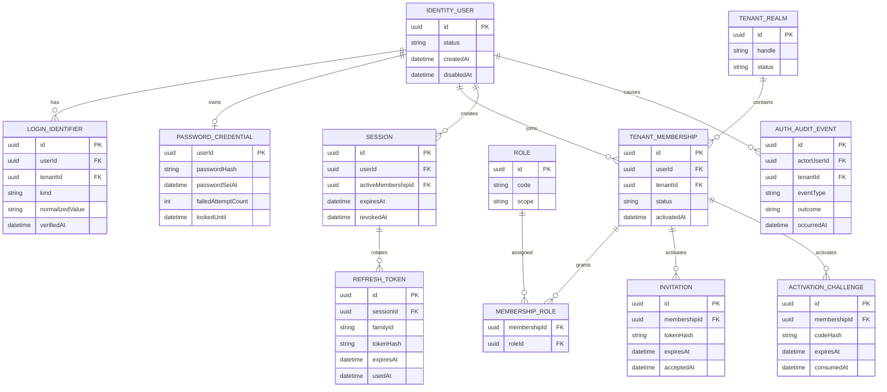
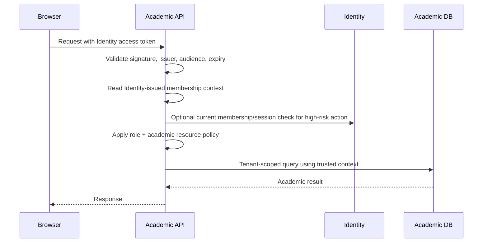

# EduPay Identity architecture

Status: approved architecture baseline; operational tunables remain implementation/configuration concerns
Date: 2026-08-08
Accepted: 2026-08-08

## 1. Identity domain model

Identity separates the person who authenticates from the tenant-scoped access they hold.

### Canonical ecosystem tenant identifier

The `TENANT_REALM.id` value, exposed as `tenantId` in Identity contracts, is the canonical ecosystem tenant identifier. EduPay Académico stores the same stable logical identifier on its tenant record. The two services own independent tenant records and databases: there are no cross-service foreign keys, shared tables, or direct database reads. The canonical identifier is exchanged only through authenticated JWT, API, and event contracts. A tenant handle or client-provided tenant value is a discovery/selection input, never authorization proof.



`TENANT_ADMIN`, `TEACHER`, `STUDENT`, and future `GUARDIAN` assignments are membership-scoped. `SYSTEM_ADMIN` is a separate platform-scoped assignment and is not silently created by adding a tenant membership. If a system administrator acts inside a tenant, Identity creates or authorizes an explicit elevated support context with a reason and audit record.

### Aggregate and record responsibilities

| Record | Identity responsibility | Important rules |
| --- | --- | --- |
| `IdentityUser` | Stable person/account identity | Does not contain tenant role or academic role; disabling it blocks authentication everywhere. |
| `LoginIdentifier` | Username or email used to locate a user | Username is tenant-scoped and may exist without email. Email is optional and has a separate normalization/verification policy. |
| `PasswordCredential` | Argon2id password verifier and lockout state | Plaintext passwords are never stored, logged, or returned. |
| `TenantRealm` | Minimal identity-facing tenant/realm reference | Its stable `id` is the canonical ecosystem tenant identifier; it holds only handle/status needed for login discovery and membership and is not the academic tenant aggregate or configuration owner. |
| `TenantMembership` | A user’s access relationship to one tenant | Status and activation state are membership-scoped. One user may have many memberships. |
| `Role` / role assignment | Platform and tenant role assignment | Membership roles are tenant-scoped; `SYSTEM_ADMIN` is a separate platform-scoped assignment and requires explicit elevation for tenant support. |
| `Session` | A revocable login instance | Owns refresh-token family, device metadata, active membership context, and audit correlation. |
| `RefreshToken` | One rotated refresh credential | Store only a hash; reuse detection revokes the full token family and session. |
| `Invitation` | Email-based account activation | One-time, expiring, hashed, and bound to a membership. |
| `ActivationChallenge` | Non-email account activation | One-time expiring activation secret, shown only through an authorized handoff; it is not a password. |
| `AuthAuditEvent` | Authentication/security evidence | Append-only application stream; excludes passwords, refresh tokens, activation secrets, and unnecessary personal data. |

### User and academic record separation

EduPay Académico owns `Student` and `Teacher`. Its records may contain an optional stable `identityUserId` reference, but never credentials, refresh tokens, roles, or invitation secrets. Linking and unlinking are deliberate and audited; unlinking access does not delete academic history.

Identity does not infer that a user is a student or teacher from an academic record. It issues access based on Identity memberships and roles. Académico still applies resource rules such as course enrollment, subject assignment, publication state, and submission ownership.

## 2. Authentication flows

### Password login

1. Client submits a login identifier, password, and optional tenant handle/device metadata.
2. Identity normalizes the identifier and resolves the candidate user and tenant membership. A tenant handle is a discovery/selection hint, not authorization proof.
3. Identity applies rate limits, account status, membership status, password verification, and lockout rules.
4. On success, Identity creates a `Session`, selects or requires an active membership, issues a short-lived access JWT, and returns a rotated refresh token only to an explicit non-browser transport; trusted browser requests receive the refresh token only as an Identity `HttpOnly` cookie.
5. Identity records a successful `LOGIN` audit event with safe metadata.
6. On failure, Identity returns a generic error and records a failed attempt without revealing whether the username, email, tenant, or account exists.

The login identifier is either an institutional username or email. Username and email are never treated as interchangeable fields. A username-only student can authenticate without an email address.

### Browser session behavior

Trusted web applications use the browser transport described in [ADR-0009](../decisions/ADR-0009-browser-session-topology.md):

- Keep the access token in frontend memory only. Do not store it in `localStorage`, `sessionStorage`, `IndexedDB`, or a persistent JavaScript-readable cookie.
- Send login and refresh requests to the Identity origin with credentials included. Login returns the access/session context and sets the Identity `HttpOnly` refresh cookie; it does not return the refresh secret in JSON.
- Refresh with `POST /api/v1/auth/refresh` and credentials included. Identity reads and rotates the cookie and returns the new access token.
- Logout with the in-memory access token and credentials included. Identity revokes the session and clears the refresh cookie.
- Configure the exact frontend origin in `IDENTITY_TRUSTED_WEB_ORIGINS`; CORS is not a substitute for the required origin check.

### Multi-tenant sign-in

If the identifier maps to more than one active membership, Identity does not guess. It returns a bounded membership-selection result or requires a tenant handle. After password verification, the client may request an active membership through the membership-context endpoint. Identity verifies that membership belongs to the user and is active before issuing a tenant-context token.

The client may request a context; it cannot grant itself a context. The resulting `tenantId`, `membershipId`, and roles in the token are written by Identity and are trusted only after the consuming API validates the token.

### Logout and revocation

- Logout revokes the current session and refresh-token family.
- Logout-all revokes every session for the user and increments a user/session revocation marker.
- Password change, password reset, account disablement, and suspicious refresh-token reuse revoke affected sessions according to the policy in the session architecture.
- Access tokens remain valid only until their short expiry unless a consuming API performs an online session-status check for a high-risk action.

## 3. Activation flows

### Email-present activation

1. An authorized tenant administrator creates or selects a user and creates a tenant membership with an intended role.
2. Identity creates a pending membership and a one-time invitation containing a random opaque token. Only its hash is persisted.
3. Identity places an invitation email in its notification outbox; the Identity notification worker sends it through Resend.
4. The recipient opens the invitation, confirms the safe tenant context, and submits a new password.
5. Identity verifies token expiry, single use, membership status, and password policy; sets the credential, marks the membership active, consumes the invitation, and emits an audit event.
6. The user starts a normal session. The administrator never knows or sets the permanent password.

Invitation acceptance must not silently attach an existing user to a second tenant without showing the tenant and recording the membership activation. If an existing verified email maps to an existing user, Identity adds the membership after the authorized invitation is accepted; it does not create a duplicate person by default.

### No-email activation

1. An authorized tenant administrator creates or activates a membership and assigns or generates a tenant-scoped institutional username.
2. Identity creates a one-time activation challenge, stores only a hash, and returns the plaintext activation information once to the authorized administrator through a protected API response.
3. The administrator provides the username and activation code to the student through the institution’s approved channel.
4. The student submits the username, activation code, and a password to the public activation endpoint.
5. Identity verifies the code, membership, expiry, attempt limit, and password policy; consumes the code, sets the password, and activates the membership.
6. The student starts a normal session. The activation code cannot be used to log in again and is not a permanent administrator-known password.

The plaintext code is never returned after creation, written to logs, included in audit metadata, or displayed in a list. An administrator can revoke and regenerate a challenge. Regeneration invalidates prior unused challenges for that membership.

### Password recovery

- Email-enabled users may request password recovery using a generic response. Identity sends a one-time expiring reset link only when a verified email is eligible.
- The reset endpoint consumes the token, sets the new password, records the reset, and revokes sessions according to policy.
- A no-email user does not receive an administrator-known password. An authorized administrator may issue a new activation challenge after confirming the student’s identity through an institution-controlled procedure.

## 4. Session architecture

### Approved MVP baseline

| Item | Approved baseline |
| --- | --- |
| Access token | JWT signed with an asymmetric key; maximum 10-minute expiry; no sensitive profile data. |
| Refresh token | 256-bit or longer random opaque secret; 30-day idle target and 90-day absolute session target. |
| Refresh rotation | Every refresh request invalidates the presented token and creates a replacement in the same family. |
| Reuse response | Revoke the token family and session, audit `REFRESH_TOKEN_REUSE`, require fresh login. |
| Session revocation | Immediate in Identity; consuming APIs enforce a maximum access-token staleness of 10 minutes, with online checks for high-risk operations. |
| Key rotation | Publish signing keys through a JWKS endpoint; support overlapping old/new keys during rotation. |
| Cookie/browser storage | Browser requests use an Identity-controlled host-only refresh cookie (`__Host-edupay-refresh` in secure mode), `HttpOnly`, `Secure`, `Path=/`, `SameSite=Lax` by default, and no `Domain`; access tokens remain in memory. Trusted-origin validation is independent of CORS. |
| Device metadata | Store coarse user-agent/device label and IP metadata subject to privacy/retention policy; never store secrets. |

Refresh tokens are stored as salted hashes with token family, issued time, expiry, used/revoked time, and session reference. A transaction must mark a token used and create its replacement atomically. Concurrent reuse is treated as suspicious.

### Authorization staleness

Role or membership changes revoke sessions, but already-issued access JWTs may exist until expiry. The consuming API must reject expired tokens and must not accept an access token beyond the agreed maximum staleness. Admin, membership, linking, and other high-risk operations should call Identity session status/introspection or use a current membership read before acting.

### JWT claims proposal

```json
{
  "iss": "https://identity.edupay.example",
  "aud": "edupay-academico-api",
  "sub": "usr_01J...",
  "sid": "ses_01J...",
  "jti": "at_01J...",
  "iat": 1786200000,
  "nbf": 1786200000,
  "exp": 1786200600,
  "tenant_id": "ten_01J...",
  "membership_id": "mem_01J...",
  "roles": ["TEACHER"],
  "scope": ["academic:use"],
  "amr": ["password"],
  "auth_time": 1786200000
}
```

Claim rules:

- `sub` is the stable Identity user ID and is the only identity reference Académico stores.
- `sid` correlates the request with a revocable Identity session and audit events.
- `iss`, `aud`, signature, `exp`, `nbf`, and acceptable clock skew are mandatory validation inputs.
- `tenant_id` and `membership_id` are present only when an active tenant context has been selected. They are Identity-issued context, not client input.
- `roles` contains the roles effective for that membership at issuance time. It does not replace Académico resource authorization.
- `SYSTEM_ADMIN` tokens without an active tenant context must not be treated as tenant access. Cross-tenant support requires a separate, explicit elevated context with a reason and audit record.
- Tokens do not contain email, username, student/teacher data, or refresh tokens. Browser JSON responses also omit the opaque refresh secret.
- `scope` is application/audience-specific and must not be interpreted as a tenant role.

## 5. Tenant membership and roles

Membership is the authorization unit for tenant access. A user can have independent status and roles in multiple tenants:

```text
IdentityUser usr_123
  ├─ Membership mem_A → TenantRealm school-a → TENANT_ADMIN
  ├─ Membership mem_B → TenantRealm school-b → TEACHER
  └─ Membership mem_C → TenantRealm school-c → STUDENT
```

Membership status is one of `PENDING_ACTIVATION`, `ACTIVE`, `SUSPENDED`, or `REVOKED`. An inactive membership cannot be selected as an active token context, even if the user has another active membership.

MVP role semantics:

| Role | Scope | Identity grants | Académico must still decide |
| --- | --- | --- | --- |
| `SYSTEM_ADMIN` | Platform/elevated support | Explicit platform administration and support entry point | Which support actions are allowed; no silent all-tenant access. |
| `TENANT_ADMIN` | One membership/tenant | Tenant membership and invitation administration | Academic structure and operational capabilities. |
| `TEACHER` | One membership/tenant | Authentication as a teacher in that tenant | Subject assignment, rosters, content, and submission access. |
| `STUDENT` | One membership/tenant | Authentication as a student in that tenant | Enrollment, published content, and own submission access. |
| `GUARDIAN` | Future tenant membership | Reserved role code and data model compatibility | No MVP UI or permissions. |

Identity grants tenant membership roles only. It does not decide which subject a teacher may access, which student roster a teacher sees, learning-content visibility, assignment ownership, or submission ownership. Those are EduPay Académico resource policies.

Role assignment changes are audited, invalidate affected sessions, and take effect on newly issued access tokens. `SYSTEM_ADMIN` does not automatically become a tenant member; tenant support requires an explicit elevated support context with a reason and audit record. User impersonation is out of scope for MVP. Academic service policies remain the final resource-level authorization layer.

## 6. Authorization boundary with EduPay Académico



Identity owns authentication, membership, role assignment, session state, invitations, and authentication audit. Académico owns student/teacher records and all academic resource policies. The boundary is:

1. Académico validates the Identity token contract.
2. Académico derives trusted tenant context from the validated token or approved current-membership check.
3. Académico rejects or ignores conflicting client `tenantId` values according to its API convention.
4. Académico checks the Identity role and then its own relationship/lifecycle rules.
5. Académico uses `sub` to match an optional academic record link; absence of a link is not a reason for Identity to create a record.
6. Académico audits academic actions; Identity audits authentication and membership actions. Events may share `sid` and correlation IDs without duplicating ownership.

### Restricted online verification

The MVP backend integration uses the service-only routes in
[ADR-0010](../decisions/ADR-0010-academico-restricted-service-auth.md). Académico authenticates
as a workload with a server-held high-entropy bearer credential over HTTPS and/or a private trusted
network. That credential cannot replace human authorization: exact academic link verification
re-reads the actor's current user, session, selected membership, tenant, and `TENANT_ADMIN` role
from Identity's database. Session status derives all returned context from the requested session.

The surface is deliberately not an Identity directory or delegated mutation API. It accepts one
exact IdentityUser target and one expected Student/Teacher role, returns minimal membership proof,
and supports `PENDING_ACTIVATION` only so Académico may persist its independently owned link before
activation. Actual authentication remains blocked until normal Identity activation succeeds.

The existing EduPay administrative login is a separate trust domain. Identity does not validate its cookies, import its passwords, or provide a migration bridge in the initial implementation. Any future federation or migration requires a new accepted ADR.

## 7. Identity security baseline

- Use Argon2id with an approved memory/time/parallelism profile and rehash on successful login when parameters change.
- Use cryptographically random, opaque, single-use tokens for invitations, reset links, and activation challenges; persist hashes only.
- Use asymmetric JWT signing and a JWKS endpoint with key IDs and overlap during rotation.
- Rate-limit login, password recovery, invitation resend, activation attempts, refresh, and management mutations by a combination of IP, normalized identifier, tenant realm, and account/session where safe.
- Use generic authentication and recovery responses to reduce user enumeration.
- Enforce account, membership, token, and invitation status on every relevant operation.
- Keep authentication audit records append-oriented, queryable by correlation/session ID, and free of secret values.
- Protect browser flows against CSRF, XSS, open redirects, and token leakage; validate redirect destinations against an allowlist.
- Keep Identity and Academic databases separate. Académico never reads Identity tables directly.
- Make provider outage behavior visible and recoverable: invitation creation must not be lost if Resend is unavailable, and resend delivery is retried from an outbox.
- For browser sessions, require an explicit trusted web-origin allowlist, reflect only allowlisted origins in credentialed CORS, reject cookie-authenticated requests with missing/untrusted origins, and clear the refresh cookie on logout, logout-all, invalid refresh, and reuse detection.
- Keep internal verification routes outside browser use, authenticate only the Académico workload credential with constant-time comparison, bound rotation overlap, requests, queries, and throttling, and reauthorize human-sensitive link operations from current Identity state.

See the [threat model](../security/threat-model.md) for threats, mitigations, and required evidence.

## 8. Implementation boundaries and remaining unresolved decisions

### In scope for the first Identity implementation

- User and credential lifecycle.
- Username and optional email login.
- Password login, logout, refresh rotation, password recovery, and session revocation.
- Tenant memberships and MVP roles.
- Email invitations and no-email activation challenges.
- Authentication/security audit events.
- JWKS and token validation contract for Académico.
- Service-to-service identity lookup needed for deliberate academic linking.

### Explicitly out of scope

- Migrating or redesigning the existing EduPay admin login.
- Student, teacher, course, subject, payment, debt, grade, attendance, or other academic records.
- Guardian UI.
- Automatic identity linking based only on matching names or unverified email.
- Impersonation without a separate support/security decision.

All ten Identity architecture decisions are accepted by owner approval and are recorded in the [ADR index](../decisions/README.md). They are no longer unresolved prerequisites for implementation bootstrap.

The following operational or implementation choices remain unresolved and must not be silently invented:

- Exact Argon2id parameters, rate-limit buckets, lockout thresholds, and abuse-response tuning.
- Production trusted web-origin ownership and cross-site deployment choice (`SameSite=Lax` versus explicitly secure `SameSite=None`) remain deployment configuration; the browser transport contract is fixed by [ADR-0009](../decisions/ADR-0009-browser-session-topology.md).
- JWT acceptable clock skew, signing-key overlap/retirement timings, and secret-manager operations.
- Device/IP metadata retention and privacy settings.
- Elevated support-context grant, duration, allowed actions, and audit-retention policy.
- Event transport, worker deployment, retry/dead-letter settings, and production Resend operations.
- TenantRealm provisioning/lifecycle workflow and the operational owner for canonical tenant-ID allocation.
